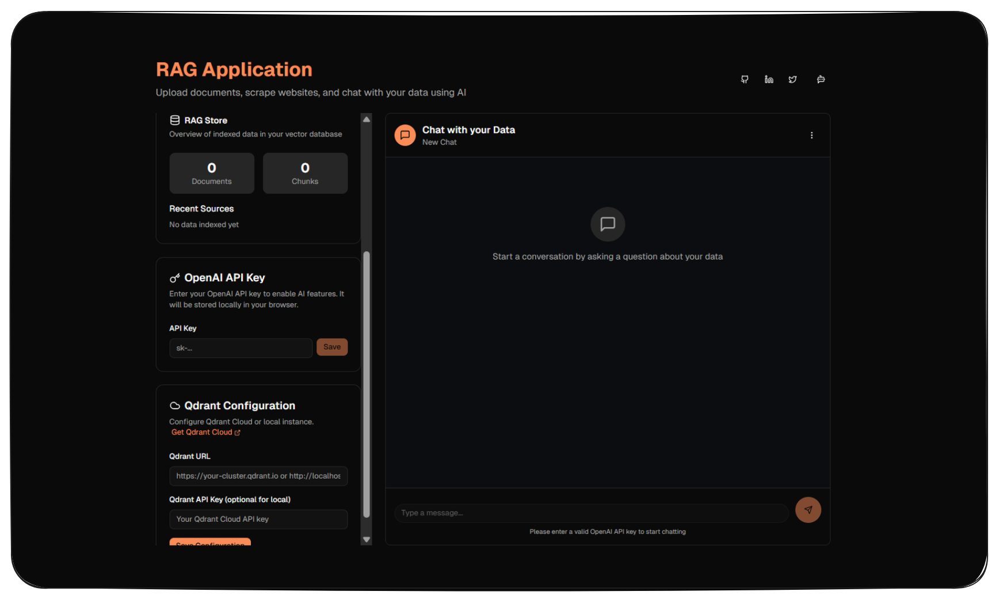

# 🤖 Free Forever RAG Application – Chat with Your Data

[](https://nextjs.org/)
[](https://reactjs.org/)
[](https://www.typescriptlang.org/)
[](https://qdrant.tech/)
[](https://www.langchain.com/)
[](https://platform.openai.com/)
[](LICENSE)

A comprehensive Retrieval Augmented Generation (RAG) application built with Next.js, featuring document processing, website scraping, and AI-powered chat functionality.



#### 🎥 **YouTube Video:** [Click here](https://www.youtube.com/watch?v=2CrcchGCpcw)

## 🔐 Security & Privacy

⚡ **Important Note:**

- Your **OpenAI API key** and **Qdrant credentials** are **never stored on our servers**.
- They are stored securely **only on your localhost (or in your environment variables like .env.local)**.
- This means your credentials always remain under your control and are not shared with any third-party servers.

👉 So, you can safely use your API key without any worries everything stays on your localhost.

## Features

- **Multiple Data Sources**: Support for text input, file uploads (PDF, CSV, TXT), and website scraping
- **Vector Database**: Qdrant integration for efficient document storage and retrieval
- **AI-Powered Chat**: OpenAI GPT integration for intelligent responses based on your data
- **Modern UI**: Dark mode interface with light orange accent colors
- **Form Validation**: React Hook Form with Zod validation for better user experience
- **Real-time Processing**: Live feedback and progress indicators
- **Flexible Deployment**: Support for both local Docker and Qdrant Cloud

## Tech Stack

- **Frontend**: Next.js 14, React, TypeScript
- **UI Components**: shadcn/ui, Tailwind CSS
- **Forms**: React Hook Form, Zod validation
- **Vector Database**: Qdrant (Local Docker or Cloud)
- **AI Integration**: OpenAI API, LangChain
- **File Processing**: PDF parsing, CSV processing, web scraping

## Prerequisites

- Node.js 18+
- OpenAI API key
- **Choose one of the following for vector database:**
  - Docker (for local Qdrant instance)
  - Qdrant Cloud account (managed service)

## Installation

1. **Clone the repository**

```bash
git clone https://github.com/BCAPATHSHALA/RAGApplication.git
cd RAGApplication
```

2. **Install dependencies**

```bash
pnpm install
```

3. **Choose your vector database setup:**

### Option A: Local Docker Setup (Recommended for Development)

3a. **Start Qdrant vector database**

```bash
docker-compose up -d
```

This will start Qdrant on `http://localhost:6333`

3b. **Set up environment variables**
Create a `.env.local` file in the root directory:

```env
QDRANT_URL=http://localhost:6333
OPENAI_API_KEY=your_openai_api_key_here
```

### Option B: Qdrant Cloud Setup (Recommended for Production)

3a. **Create a Qdrant Cloud account**

- Visit [https://cloud.qdrant.io/](https://cloud.qdrant.io/)
- Sign up for a free account
- Create a new cluster
- Get your cluster URL and API key

3b. **Set up environment variables**
Create a `.env.local` file in the root directory:

```env
QDRANT_URL=https://your-cluster-url.qdrant.io
QDRANT_API_KEY=your_qdrant_api_key
OPENAI_API_KEY=your_openai_api_key_here
```

4. **Run the development server**

```bash
pnpm run dev
```

5. **Open your browser**
   Navigate to `http://localhost:3000`

## Configuration

### In-App Configuration

The application provides an intuitive interface for configuration:

1. **OpenAI API Key**: Enter your OpenAI API key in the API Key section
2. **Qdrant Configuration**:
   - For local Docker: Use `http://localhost:6333` (no API key needed)
   - For Qdrant Cloud: Enter your cluster URL and API key from the dashboard

### Environment Variables (Alternative)

You can also configure via environment variables:

- `QDRANT_URL`: Qdrant database connection URL
- `QDRANT_API_KEY`: Qdrant API key (required for cloud, optional for local)
- `OPENAI_API_KEY`: OpenAI API key for embeddings and chat

## Usage

### 1. Configure Services

- **OpenAI API Key**: Enter your API key (must start with 'sk-')
- **Qdrant Setup**: Configure either local Docker or Qdrant Cloud connection

### 2. Add Data Sources

**Text Input**:

- Paste text directly into the textarea
- Minimum 10 characters required
- Text will be chunked and indexed automatically

**Website Scraping**:

- Enter a valid URL (must include http:// or https://)
- The system will scrape and index the website content

**File Upload**:

- Upload PDF, CSV, or TXT files (max 10MB)
- Files are processed and chunked automatically
- Progress feedback provided during processing

### 3. Monitor RAG Store

- View real-time statistics of indexed documents
- See total documents and chunks
- Review recent data sources

### 4. Chat with Your Data

- Use the chat interface to ask questions about your indexed data
- The AI will provide responses based on the most relevant document chunks
- Conversation history is maintained during the session
- Create multiple chat sessions for different topics

## API Endpoints

- `POST /api/index-text` - Index text content
- `POST /api/index-website` - Scrape and index website
- `POST /api/index-file` - Process and index uploaded files
- `POST /api/chat` - Chat with indexed data
- `GET /api/rag-store` - Get indexed document statistics
- `DELETE /api/delete-index` - Delete all indexed data

## Architecture

### Vector Database Options

#### Local Docker (Development)

- **Qdrant**: High-performance vector database running in Docker
- **Port**: 6333 (default)
- **Storage**: Persistent volume for data retention
- **Configuration**: No API key required

#### Qdrant Cloud (Production)

- **Managed Service**: Fully managed Qdrant instance
- **Scalability**: Auto-scaling based on usage
- **Security**: Built-in authentication and encryption
- **Global**: Multiple regions available
- **Configuration**: Requires cluster URL and API key

### Document Processing

- **Text Chunking**: Recursive character text splitter (1000 chars, 200 overlap)
- **PDF Processing**: LangChain PDF loader for text extraction
- **CSV Processing**: Structured data handling with metadata
- **Web Scraping**: Cheerio for clean HTML content extraction

### AI Integration

- **OpenAI GPT-4**: For generating contextual responses
- **LangChain**: Document processing and RAG pipeline orchestration
- **Embeddings**: text-embedding-3-large for high-quality vector representations

## Deployment

### Local Development

```bash
pnpm run dev
```

### Docker Deployment (with local Qdrant)

1. Build the application:

```bash
pnpm run build
```

2. Start with Docker Compose:

```bash
docker-compose up -d
```

### Vercel Deployment (with Qdrant Cloud)

1. Deploy to Vercel:

```bash
vercel deploy
```

2. Set environment variables in Vercel dashboard:
   - `QDRANT_URL` (your Qdrant Cloud cluster URL)
   - `QDRANT_API_KEY` (your Qdrant Cloud API key)
   - `OPENAI_API_KEY` (your OpenAI API key)

### Production Considerations

**For Qdrant Cloud:**

- Use environment variables for sensitive configuration
- Enable API key authentication
- Monitor usage and costs in Qdrant Cloud dashboard
- Consider data residency requirements

**For Local Docker:**

- Ensure persistent storage for production data
- Configure proper backup strategies
- Monitor resource usage and scaling needs
- Secure network access to Qdrant instance

## Troubleshooting

### Common Issues

**"Collection not found" errors:**

- The collection is created automatically when you first index data
- Ensure Qdrant is running and accessible
- Check your Qdrant URL and API key configuration

**File upload failures:**

- Check file size limits (10MB max)
- Ensure supported file formats (PDF, CSV, TXT)
- Verify OpenAI API key is valid

**Chat not working:**

- Ensure you have indexed some data first
- Check OpenAI API key configuration
- Verify Qdrant connection is working

### Performance Tips

- Use Qdrant Cloud for better performance and reliability
- Index documents in smaller batches for large datasets
- Monitor OpenAI API usage and costs
- Consider chunking strategies for different document types

## Contributing

1. Fork the repository
2. Create a feature branch
3. Make your changes
4. Add tests if applicable
5. Submit a pull request

## License

MIT License - see LICENSE file for details

## Support

For issues and questions:

- Create an issue on GitHub
- Check the troubleshooting section
- Review the API documentation
- Visit [Qdrant Cloud Documentation](https://qdrant.tech/documentation/)

## Social Links

- [LinkedIn](https://linkedin.com/in/manojofficialmj)
- [Twitter](https://twitter.com/manojofficialmj)
